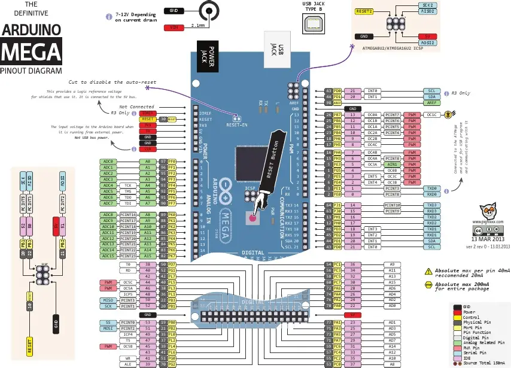

<h1 align="center">Microcontroller based DIY Smart Lock</h1>

<p align="center"><i>DIY Smart Lock with Arduino and RFID</i></p>

<p align="center">
    
    
    
    
</p>

<p align="center">
    <a href="#-project-intro"></a>
    <a href="#-components"></a>
    <a href="#-project-structure"></a>
</p>

## Table of Contents

- [🚀 Project intro](#-project-intro)
- [🧩 Components](#-components)
- [📁 Project structure](#-project-structure)
- [📄 License](#-license)

## 🚀 Project intro

In this project, I have used an RFID reader (MFRC522), Arduino microcontroller (Mega 2560), Arduino programming language and other components to create an RFID-based smart lock. This lock is a small version of an automated RFID-based smart lock, an important component of an automated home.

## 🧩 Components

- Arduino. I've used a Mega 2560, though any Arduino board or clone will suffice.
- 3 x 220 ohm resistors
- 1 x 10k ohm resistor
- Logic-level N channel MOSFET
- MFRC522 module with at least two cards
- Red, blue, and green LEDs
- 12v Solenoid ($2)
- 12v power supply
- Breadboard and hook up wires

## 📁 Project structure

```txt
Microcontroller-based-DIY-Smart-Lock/
├── CSE323_PROJECT/
│   └── CSE323_PROJECT.ino
├── HARDWARE SETUP/
├── LICENSE
└── README.md
```

### Project setup

#### Pin diagram

The following Arduino Mega 2560 pin diagram shows the main board connections and pin layout used during the hardware setup.



### Demonstration

Watch the project demonstration video below to see the smart lock in action.

<iframe width="100%" height="420" src="https://www.youtube.com/embed/GOO84CGBPz8" title="Smart Lock Demonstration" frameborder="0" allow="accelerometer; autoplay; clipboard-write; encrypted-media; gyroscope; picture-in-picture; web-share" allowfullscreen></iframe>

## 📄 License

This project is licensed under the MIT License. See the `LICENSE` file for details.
